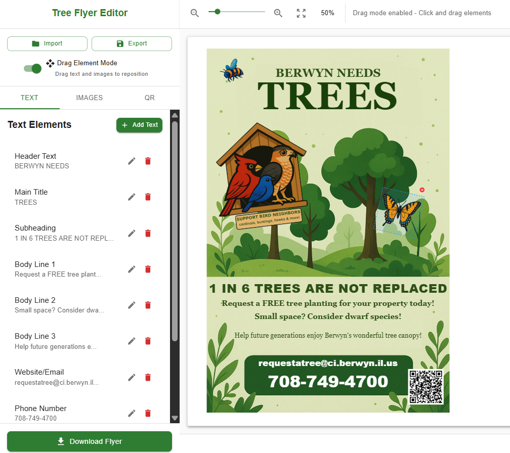

# Tree Flyer Maker


If you want to create a point of contact for your neighbors to embrace more tree planting in your neighborhood, create a flyer and pass em around as you go for walks!

Visit [this page](https://trees.ashhill.dev) to use.


## Example


<p align="center">
  
  
</p>

###



## Features

- Pan, zoom and drag elements for customization
- Add custom text and images
  - Rotate, scale, choose font, colors and more!
- Save your progress by exporting/importing `.zip` artifacts
- Generate QR codes for URLs
- Export as PNG

### Coming Soon (or never. idk)

- DARK MODE 😵
- Offer some pre-generated decorative images
- Add more fonts
- Layers for images (send to back, bring to front, etc.)
- More templates or upload custom template

## Tips

The art for this was generated on [OpenAI's Sora](https://sora.chatgpt.com/) using the **Cartoonify** filter. This should help match the art style of the background image.

Keep in mind the flyer will print at 8.5 x 11 inches (216mm x 279mm).

## Development

Do the following to start the development server:

``` sh
npm install
npm run dev
```

